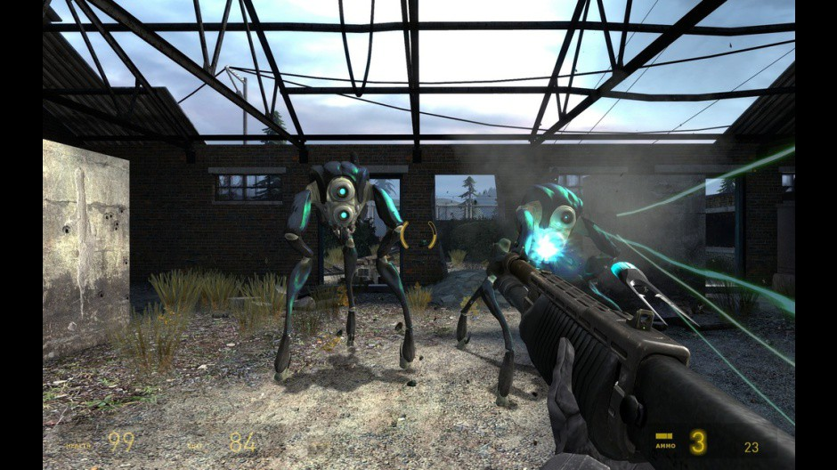
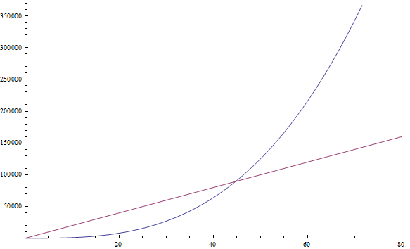

原文：[A Gentle Introduction to Algorithm Complexity Analysis](http://discrete.gr/complexity/)

# 浅谈算法复杂性分析

## 介绍

如今众多没有理论计算机科学背景的程序员编写了一些最酷最有用的软件，这些软件我们时常会在网上看到并且日常都在使用。他们仍然是非常棒且有创造力的程序员，我们感谢他们所做的一切。

然而，理论计算机科学有它自己的使用和应用场景，而且结果是相当实用的。这篇文章面向那些知道此间艺术但是没有任何理论计算机科学背景的人，我将展现计算机科学中最有用的工具之一：大 O 符号和算法复杂度分析。作为曾在计算机科学学术领域工作过，也曾在该行业构建过生产级软件的人，这是我在实践中发现的真正有用的工具之一，所以我希望在读过这篇文章之后你可以将它应用到自己代码中，让代码变得更好。阅读本文后，你应该能够理解计算机科学家使用的所有常用术语，如“大 O”，“渐近行为”和“最坏情况分析”。

本文还面向来自希腊或其他[国际奥林匹克信息学竞赛](https://en.wikipedia.org/wiki/International_Olympiad_in_Informatics)，以及类似算法竞赛的初中和高中生。 因此本文没有任何数学先决条件，而且会提供你所需要的背景知识以便继续研究算法并对其背后的理论有扎实的掌握。作为曾经参加过这些学生竞赛的人，我强烈建议你仔细阅读整篇介绍材料并尝试完全理解它，因为在研究算法和学习更多高级技巧时，这是很有必要的。

我相信这篇文章对那些没有太多理论计算机科学经验的业内程序员很有帮助（事实上，一些最鼓舞人心的软件工程师从未去过大学）。但因为这也是为学生准备的，有时听起来有点像教科书。此外，本文中的一些主题对你来说可能过于明显；例如，你可能在高中的时候见过它们。如果你觉得这些你都理解，你可以跳过它们。其余主题则会更深入一些，且变得有点偏理论，因为参加竞赛的学生需要比一般实践者更多地了解理论算法。但是这些东西仍然是很容易了解，其理解起来也不是非常困难，所以很值得你花时间去学习。由于本文最初是针对高中生的，不要求有数学背景，所以任何有一些编程经验的人(例如，你知道递归是什么)都可以顺利完成。

在本文中，你将发现许多有趣资源的链接，这些资源超出了我们所讨论主题的范围。如果你是一名业内程序员，那么你可能已经熟悉了其中的大部分概念。如果你是一名参加竞赛的中学生，这些链接将会给你提供一些关于计算机科学或软件工程的其他领域的线索，这些领域你可能还没有探索过，你可以看看它们来拓宽你的兴趣。

大 O 符号和算法复杂度分析是许多业内程序员和中学生都难以理解，恐惧或完全避免的无用东西。但它并不像一眼看上去那么难或饱含理论性。算法复杂度只是一种正式测量程序或算法运行速度的方法，因此它确实非常实用。让我们从这个主题的动机开始吧。

## 动机

我们已经知道有一些工具可以衡量程序的运行速度。有些程序称为`分析器`（profilers），它以毫秒为单位测量运行时间，可以通过发现瓶颈来帮助我们优化代码。虽然这是一个有用的工具，但它与算法复杂度并不真正相关。算法复杂度旨在在概念层面比较两个算法 --- 忽略底层细节，例如实现的编程语言，算法所运行的硬件或给定 CPU 的指令集。我们想要仅仅从它们是什么的角度来比较算法：程序是如何计算的。 计算毫秒对我们没有帮助，用[汇编](https://en.wikipedia.org/wiki/Assembly_language)等低级编程语言编写的差的算法很可能比用 [Python](https://www.python.org/) 或 [Ruby](http://www.ruby-lang.org/en/) 等高级编程语言编写的好的算法运行得快得多。所以是时候定义一个“更好的算法”到底是什么了。

由于算法是仅执行计算的程序，而不是计算机经常执行的其他操作，例如网络任务或用户输入和输出，因此复杂度分析允许我们测量程序执行计算时的速度。纯粹`计算`（computational）的操作的例子包括数值[浮点运算](https://en.wikipedia.org/wiki/Floating-point_arithmetic)，例如加法和乘法; 在装入 RAM 的数据库中搜索给定值; 确定人工智能角色在视频游戏中走过的路径，这样他们只需要在虚拟世界中走很短的距离（见**图1**）；或者在字符串上运行[正则表达式](https://www.regular-expressions.info/)模式匹配。显然，计算在计算机程序中无处不在。



**图一**：视频游戏中的人工智能角色在虚拟世界中导航时使用算法来避开障碍物

复杂度分析也是一种工具，它允许我们解释当输入变大时算法的行为。如果我们给它一个不同的输入，算法会如何运行？如果我们的算法需要 1 秒来运行大小为 1000 的输入，那我将输入大小加倍，它会如何运行？它会跑得一样快，一半的速度，还是四倍的速度？在实际编程中，这很重要，因为它允许我们预测当输入数据变大时算法的行为。例如，如果我们为一个 web 应用程序编写了一个算法，它可以很好地处理 1000 个用户，并测量其运行时间，使用算法复杂度分析，我们可以很好地了解当我们得到 2000 个用户时将会发生什么。对于算法竞赛，复杂度分析让我们洞察我们的代码在用于测试程序正确性的最大测试用例中将会运行多长时间。因此，如果我们测量了程序在小输入下的行为，我们就能很好地了解它在大输入下的行为。让我们从一个简单的例子开始：查找数组中的最大元素。

## 计数指令

在本文中，我将使用各种编程语言作为示例。但是，如果你不知道特定的编程语言，也不要绝望。既然你了解编程，即使你不熟悉所选择的编程语言，也应该能够毫无问题地阅读示例，因为它们很简单，而且我不会使用任何深奥的语言特性。如果你是一名参加算法竞赛的学生，你很可能会使用 [C++](http://www.cplusplus.com/doc/tutorial/)，所以对你来说应该没有问题。在这种情况下，我建议使用 C++ 进行练习。

数组中的最大元素可以使用一段简单的代码来查找，比如这段 Javascript 代码。给定一个大小为 n 的输入数组 A：

```js
var M = A[ 0 ];
 
for ( var i = 0; i < n; ++i ) {
    if ( A[ i ] >= M ) {
        M = A[ i ];
    }
}
```

现在，我们要做的第一件事是计算这段代码执行了多少`基本指令`（fundamental instructions）。我们只会做一次而且在后续演进理论的时候就没必要了，所以请忍受我一会儿。当我们分析这段代码时，我们想把它分解成简单的可以由 CPU 直接执行（或接近于直接执行）的指令。我们假设我们的处理器可以执行以下操作，每个操作作为一条指令：

* 为变量赋值
* 查找数组中特定元素的值
* 比较两个值
* 递增一个值
* 基本算术运算，如加法和乘法

我们将假设分支后(在 if 条件被求值之后，在 if 和 else 之间的部分)的指令会立即执行，而且不去计算这些指令。

上述的第一行代码是：

```js
var M = A[ 0 ];
```

这行代码包括两个指令：一个用于查找 A[0]，另一个用于将值分配给 M(我们假设 n 总是至少为 1)。不论 n 是什么，这两个指令总是算法所需要的。for 循环初始化代码也总是会运行的。这样我们再需要两个指令：赋值 和 比较：

```js
i = 0;
i < n;
```

这些指令将会在第一次 for 迭代的时候执行。每个 for 迭代后，我们还需要运行两条指令，自增 i 和 一个用来检查我们是否还在循环中的比较操作：

```js
++i;
i < n;
```

如果我们忽略循环体，这个算法需要的指令数是 4 + 2n。也就是说，for 循环开始时有 4 条指令，每次迭代结束时有 2 条指令。我们现在可以定义一个数学函数 f(n)，给定 n，它给出算法需要的指令数。对于空的 for 循环体，我们有 f(n) = 4 + 2n。

## 最坏情况分析

现在，看看 for 循环体，我们有一个数组查找操作和一个总是发生的比较操作：

```js
if ( A[ i ] >= M ) { ...
```

这里有两条指令。但是 if 体可能会运行，也可能不不会运行，这取决于数组的实际值。如果碰巧 A[ i ] >= M，那么我们将会运行两个额外的指令——数组查找和赋值：

```
M = A[ i ]
```

但是现在我们不能简单地定义 f(n) 了，因为我们的指令数不仅依赖于 n 还依赖于输入。例如，对于 A = [ 1, 2, 3, 4]，算法需要比 A = [ 4, 3, 2, 1] 更多的指令。在分析算法时，我们经常要考虑最坏的情况。我们的算法最坏的结果是什么？我们的算法什么时候需要最多的指令来完成？在本例中，当数组按递增顺序排列时，例如 A = [ 1, 2, 3, 4 ]，在这种情况下，每一次都需要替换 M，这样就产生了最多的指令。计算机科学家给它起了个好听的名字，叫做`最坏情况分析`(worst-case analysis);这只不过是在我们最不走运的时候考虑这个情况。所以在最坏的情况下，我们在 for 循环体内有 4 条指令在运行，因此 f(n) = 4 + 2n + 4n = 6n + 4。对于函数 f，给定问题大小 n，给出最坏情况下需要的指令数。

## 渐进特性（Asymptotic behavior）

给定这样一个函数，我们就很清楚算法的速度有多快。但是，正如我所承诺的，我们并不需要完成计算程序中指令数的繁琐任务。此外,每种编程语言语句所需的实际 CPU 指令数取决于编程语言的编译器和可用的 CPU 指令集(即无论是你 PC 上的 AMD 或 Intel Pentium 处理器,或 Playstation 2 上的 MIPS 处理器)，我们说过我们会忽略这一点。现在，我们将通过一个“过滤器”运行我们的“f”函数，它将帮助我们摆脱那些计算机科学家宁愿忽略的次要细节。

在函数 6n + 4 中，我们有两个项：6n 和 4。在复杂度分析中，我们只关心当程序输入 n 变大时，指令计数函数会发生什么变化。这与之前关于“最坏情况”行为的想法是一致的：我们感兴趣的是我们的算法在处理极差情况，面对困难挑战时的行为。注意，这在比较算法时非常有用。如果一个算法在较大的输入上胜过另一个算法，那么当给定一个更简单、更小的输入时，速度更快的算法很可能仍然更快。**从我们要考虑的项来看，我们会去掉所有增长缓慢的项只保留那些随着 n 变大增长较快的项**。很明显，随着 n 的增大，4 仍然是 4，但是 6n 变得越来越大，所以对于更大的问题，它变得越来越重要。因此，我们要做的第一件事就是去掉 4，保持函数 f(n) = 6n。

仔细想想，这是有道理的，因为 4 只是一个“初始化常数”。不同的编程语言可能需要不同的时间初始化。例如，Java 需要一些时间来初始化它的[虚拟机](https://en.wikipedia.org/wiki/Java_virtual_machine)。因为我们忽略了编程语言的差异，所以忽略这个值才有意义。

我们会忽略的第二件事是 n 前面的乘法常数，所以我们的函数将变成 f(n) = n。正如你所看到的这已经简化了很多东西。同样，如果我们考虑不同的编程语言是如何编译的，那么去掉这个乘法常数也是有意义的。“数组查找”语句也许会被不同语言编译成不同指令。例如，在 C 语言中，执行 A[i] 不包含检查 i 是否在声明的数组大小内，而 Pascal 会做检查 。所以，下面的 [Pascal](https://en.wikipedia.org/wiki/Pascal_(programming_language)) 代码：

```
M := A[ i ]
```

跟下面的 C 代码是一样的：

```C
if ( i >= 0 && i < n ) {
  M = A[ i ];
}
```

因此，当我们计算不同的编程语言的指令时，我们有理由期望它们会产生不同的因素。在我们使用 Pascal 的哑编译器而不考虑可能的优化的示例中，Pascal 对每个数组访问需要 3 条指令，而不是像 C 那样的 1 条指令。去掉这个因素就等于忽略了特定编程语言和编译器之间的差异，只分析算法本身的思想。

如上所述，这种“去掉所有因素”和“保持最大增长项”的过滤器就是我们所说的`渐近特性`。所以 f(n) = 2n + 8 的渐近特性由函数 f(n) = n 来描述，从数学上讲，这里我们关心的是函数 f 趋于无穷时的极限；但是如果你不明白这句话的正式含义，不要担心，因为这就是你需要知道的全部。(顺便说一句，在严格的数学分析中，我们不能去掉常数限制；但出于计算机科学的目的，我们希望这样做，原因如上所述。)让我们通过几个例子来熟悉这个概念。

让我们通过去掉常数因子和保留增长最快的项来找出下面示例函数的渐近行为。

1. f( n ) = 5n + 12 得 f( n ) = n
   使用与上面完全相同的推理。
2. f( n ) = 109 得 f( n ) = 1
   我们去掉了乘数 109 * 1，但仍然不得不保留 1 来表明这个函数有一个非零值
3. f( n ) = n^2 + 3n + 112 得 f( n ) = n^2
   对于足够大的 n 来说，n^2 增长大于 3n，所以我们保留了它
4. f( n ) = n^3 + 1999n + 1337 得 f ( n ) = n^3
   尽管 n 前面的因子相当大，我们仍然可以找到足够大的 n 以至于 n^3 比 1999n 还大。因为我们感兴趣的是 n 值非常大的情况，所以我们只保留 n^3（参考**图 2**)
5. f( n ) = n + sqrt(n) 得 f( n ) = n
   这样做的原因是当我们增长 n 的时候 n 的增速比 sqrt(n) 要快



**图 2**: 蓝线代表的 n^3 函数，在 n = 45 之后，比 1999n 函数更大。在那之后，它将永远保持较大。

你可以自己试试下面的例子

练习 1

1. f(n) = n^6 + 3n
2. f(n) = 2^n + 12
3. f(n) = 3^n + 12
4. f(n) = n^n + n
   
（写下你的结果；后面会给出解答）

如果你对上面的某项有疑惑，代入一个大的 n 看看哪一个结果更大。很简单,不是吗?

---

## 复杂度

所以这告诉我们的是，因为我们可以去掉所有这些装饰常数，所以很容易看出程序的指令计数函数的渐近行为。事实上，任何没有循环的程序都会有 f(n) = 1 的复杂度，因为它需要的指令数只是一个常数(除非它使用递归;见下文)。任何使用一个从 1 到 n 循环的程序，复杂度为 f(n) = n，因为在循环前、循环后指令数都是常数，并且循环总共会运行 n 次。

现在，这应该比计算单个指令简单得多，也不那么单调乏味，所以让我们看几个例子来熟悉它。下面的 [PHP](https://php.net/) 程序检查数组 a 中是否存在大小为 n 的特定值:

```php
<?php
    $exists = false;
    for ($i = 0; $i < n; ++$i) {
        if ($A[$i] == $value) {
            $exists = true;
            break;
        }
    }
?>
```

这种在数组中搜索值的方法称为`线性搜索`。这是一个合理的名称，因为这个程序复杂度是 f(n) = n (我们将在下一节中定义"线性“的确切含义)。你可能会注意到这里有一个“break”语句，它可能会使程序更快地终止，甚至仅在一次迭代之后。但是请记住，我们感兴趣的是最坏的情况，所以对于这个程序而言，数组 A 不包含所需的值。我们的指令计数函数依然为 f(n) = n。

练习 2

系统地分析上面的 PHP 程序在最坏情况下对于 n 所需要的指令数，以找到 f(n)，类似于我们分析第一个 Javascript 程序。然后证明，渐进等价情况下，我们有 f(n) = n。

---

让我们来看看一个 Python 程序，它将两个数组元素相加，生成一个和，并将其存储在另一个变量中:

```python
v = a[ 0 ] + a[ 1 ]
```

这里我们有常数个指令，所以 f(n) = 1

下面的 C++ 程序检查大小为 n 的 vector A 里面是否包含两个一样的值：

```cpp
bool duplicate = false;
for (int i = 0; i < n; ++i) {
  for (int j = 0; j < n; ++j) {
    if (i != j && A[i] == A[j]) {
      duplicate = true;
      break;
    }
  }
  if (duplicate) {
    break;
  }
}
```

这里我们有两个相互嵌套的循环，我们有一个由 f(n) = n^2 描述的渐近特性。

> **经验法则:** 简单的程序可以通过计算程序的嵌套循环来分析。在 n 项上的一个循环产生 f(n) = n。在一个循环中的一个循环产生 f(n) = n^2。循环中的循环中的循环产生f(n) = n^3。

如果我们有一个在循环中调用函数的程序，并且我们知道被调用函数执行的指令数，那么很容易确定整个程序的指令数。让我们来看看这个 C 例子:

```cpp
int i;
for (i = 0; i < n; ++i) {
  f(n);
}
```

如果我们知道 f(n) 是一个恰好执行 n 条指令的函数，那么我们就可以知道整个程序的指令数渐进于 n^2，因为函数恰好被调用 n 次。

> **经验法则:** 给定一系列连续的 for 循环，其中最慢的循环决定程序的渐近行为。两个嵌套循环后面跟着一个单独的循环，这和只有嵌套循环是很接近的，因为嵌套循环处于支配地位。

现在，让我们切换到计算机科学家使用的奇特符号。当我们求出精确的 f 时，我们会说我们的程序是 Θ(f(n))。例如，上面的程序分别是 Θ(1)，Θ(n^2) 和 Θ(n^2)。Θ(n)发音为 “theta of n”。有时候我们将原来包括常数的指令计数函数称为 Θ(something)。比如，我们会称函数 f(n) = 2n 为 Θ(n) —— 这里没什么新东西。我们也可以写 2n ∈ Θ(n) 来显示的表明 “两个 n 是 Θ(n)”。不要对这个符号感到困惑：它的意思是，如果我们计算了一个程序需要的指令数，这些指令数是 2n，那么我们算法的渐近行为是由去掉常数得到的 n 来描述的。下面是有关这个符号的一些数学表述:

1. n^6 + 3n ∈ Θ(n^6)
2. 2^n + 12 ∈ Θ(2n)
3. 3^n + 2n ∈ Θ(3n)
4. n^n + n ∈ Θ(n^n)

顺便说一下，如果你解出了上面的练习 1，这些就是你应该已经得出的答案。

**我们称这个函数，如我们放在 Θ(here) 里面的东西为`时间复杂度`或者只称做算法的`复杂度`。** 所以具有 Θ(n) 的算法具有复杂度 n。我们对于 Θ(1)，Θ(n)，Θ(n^2) 和 Θ(log(n)) 也有特殊的名字，因为它们经常出现。我们说 Θ(1) 算法是一个`常数时间算法`，Θ(n) 是 `线性的`，Θ(n^2) 是`二次的`，Θ(log(n)) 是`对数的`(如果你还不知道对数是什么，不要担心 —— 我们一分钟后会了解到)

> **经验法则:** 具有较大 Θ 的程序比具有较小 Θ 的程序运行得慢。

## 大 O 符号

现在，有时确实很难像我们上面做的那样精确地计算出算法的行为，特别是对于更复杂的例子。然而，我们可以说我们的算法的行为永远不会超过某个界限。这将使我们的工作更容易，因为我们不必精确地指定算法运行的速度，即使像以前那样忽略常数。我们要做的就是找到一个定界。这很容易用一个例子来解释。
